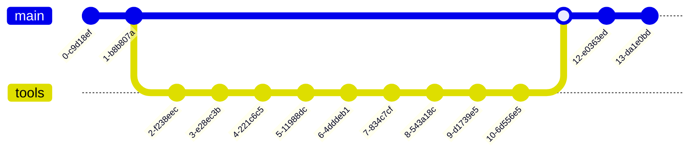

# OctoTools

A purpose built Houdini Package for use in a show/shot/task workflow. This package is for use with Houdini 19.x.x

- [OctoTools](#houdini-package-template)
  - [Overview](#overview)
  - [Getting Started](#getting-started)
  - [Installing The Package](#installing-the-package)

## Overview

This repo is meant to house generic shot tools and otl/hda libraries from various 3rd party vendors, making it easy to distribute tools studio wide.

## Getting Started

1. Download the latest release onto a network location / server

    

## Installing the package

1. Copy the 'OctoTools.json' file to your houdini packages directory. Once this has been done, launch houdini and you should see an OctoTools menu. If you would like to check that the packages have loaded, switch to the '!OctoTools' desktop and go to the package broswer tab.

    

## Mermaid Examples

Markdown Sequence Diagram temp:

Markdown Flowchart temp:

